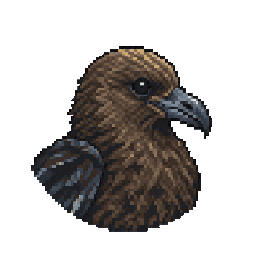

# skua

A minimal, fast, modular Discord bot in Go, and a test bed for what Discord bots can
do. Built on [disgo](https://github.com/disgoorg/disgo) and
[pgx v5](https://github.com/jackc/pgx).

- Identifies only with the gateway intents the Developer Portal has actually granted,
  read from the application's flags, and restarts itself when a toggle changes.
- Every command declares who may run it, or the bot refuses to start.
- Per-guild write caps in a single compare-and-swap (about 7ns, no allocation).
- Nothing it sends can ping anyone.

[`SPEC.md`](SPEC.md) is the one-page design and the experiment log.

## Run

```sh
cp .env.example .env    # DISCORD_BOT_TOKEN, SKUA_BOOTSTRAP_ADMIN_USER_ID
go run ./cmd/skua       # Postgres optional: set SKUA_DATABASE_URL
# or
docker compose up --build
```

## Go live

After the first merge to `main` has built the image:

```sh
go run ./tools/setup
```

It asks for the bot token (hidden), checks it with Discord, makes the application's
owner the bootstrap admin, writes both to the host, sets the bot's avatar and banner,
reports the privileged intents, deploys through GitHub Actions, waits for the bot to
connect, and prints the invite link. Safe to run again at any time, for example to
rotate the token.

## Deploy

Merging to `main` builds an arm64 image to GHCR and deploys it to the host with
Docker Compose, once the repository variable `DEPLOY_ENABLED` is `true`.
`scripts/deploy.sh` is the manual path.
